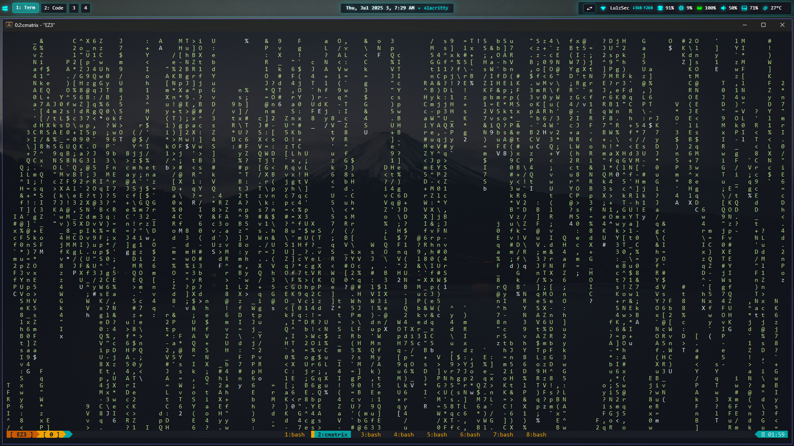
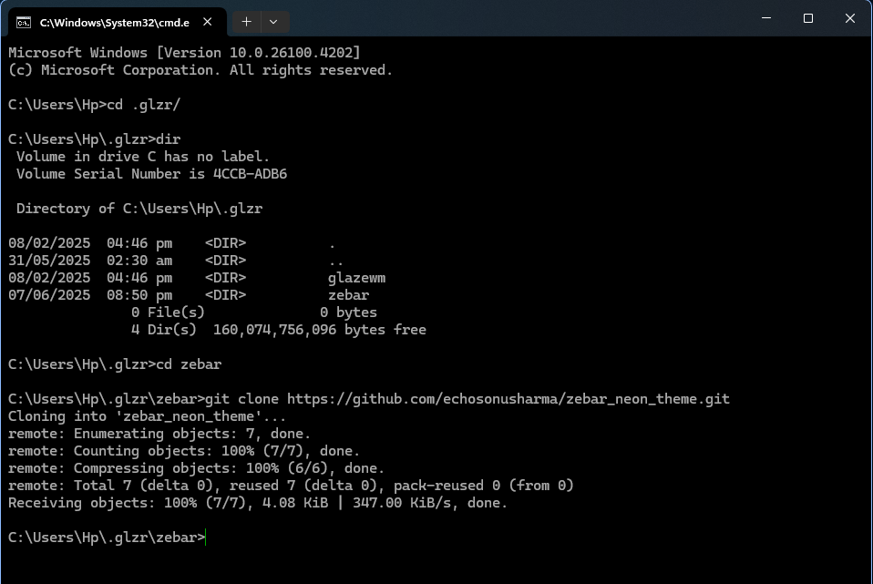
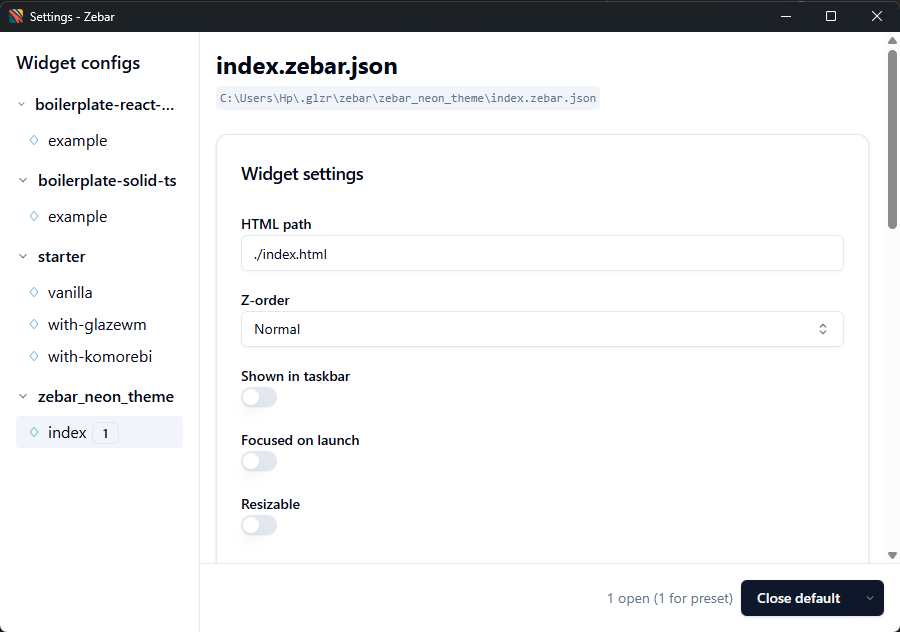

# Zebar Neon Theme

A vibrant neon-themed configuration for [Zebar](https://github.com/glzr-io/zebar).

> [!NOTE]  
> This theme was created before the Zebar Marketplace existed, so the guide below was for manual installation.



## Installation

1. **Navigate to Zebar config directory**
   ```bash
   cd %userprofile%/.glzr/zebar
   ```

2. **Clone this repository**
   ```bash
   git clone https://github.com/echosonusharma/zebar_neon_theme.git
   ```
  
   
3. **Apply the theme**
   - Reload Zebar
   - Open Zebar settings
   - Select "zebar_neon_theme"
   - Close current widget and apply

  

4. **Set neon theme as default**
   - update the `settings.json` in the zebar config directory to -
   ```json
   {
      "$schema": "https://github.com/glzr-io/zebar/raw/v3.1.1/resources/settings-schema.json",
      "startupConfigs": [
         {
            "pack": "zebar_neon_theme",
            "widget": "index",
            "preset": "default"
         }
      ]
   }
   ```

## Customization

Edit `styles.css` to customize colors, fonts, or layout.

## Features

- Modern neon color scheme
- Clean, minimalist design
- Optimized for readability
- Customizable styling

## Contributing

Feel free to submit issues, fork the repository, and create pull requests for any improvements.

## License

This project is open source. Please check the license file for more details.
